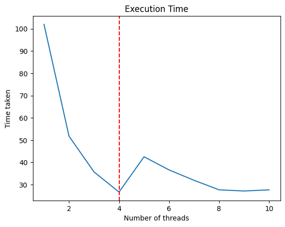

# Matrix Multiplication with Threading

This repository contains Python code that demonstrates matrix multiplication (size: 100 x 100) using multiple threads and measures the execution time for different numbers of threads.

## Methodology

### 1. Matrix Multiplication Function

The `matrix_multiply()` function performs matrix multiplication between a list of matrices and a constant matrix. It takes the following parameters:

- `matrix`: List of matrices to be multiplied.
- `constant_matrix`: The constant matrix.
- `result`: List to store the results of matrix multiplication.
- `index`: Index of the current matrix multiplication operation.

### 2. Main Function

The `our_main()` function initializes random matrices and a constant matrix. It then starts multiple threads to perform matrix multiplication using the `matrix_multiply()` function. The number of threads used is determined by the input parameter `num_threads`.

### 3. Thread Management

The program controls the number of active threads running simultaneously. It starts a new thread for each matrix multiplication operation and waits until the number of active threads becomes less than or equal to the specified number (`num_threads`). This ensures that the program does not spawn more threads than the specified limit.

### 4. Performance Measurement

The execution time of the matrix multiplication operation with varying numbers of threads (from 1 to 10) is measured and stored in the `time_100` list. The execution time is then plotted against the number of threads using Matplotlib.

## 5. Result Table

Number of Threads : Time taken (seconds)
        1         :      101.9409
        2         :      51.7445
        3         :      35.7066
        4         :      26.685
        5         :      42.5201
        6         :      36.6209
        7         :      31.9514
        8         :      27.678
        9         :      27.1544
        10        :      27.6682

## 6. Result Graph

## 7. Result Explanation

We achieve the most optimal results when the number of threads is set to 4, corresponding to the number of **performance** cores in my computer (Apple MacBook Air M1). For thread counts less than or greater than 4, the execution time increases.

## Author

Aditya Vashishta

## License

This project is licensed under the [MIT License](LICENSE).